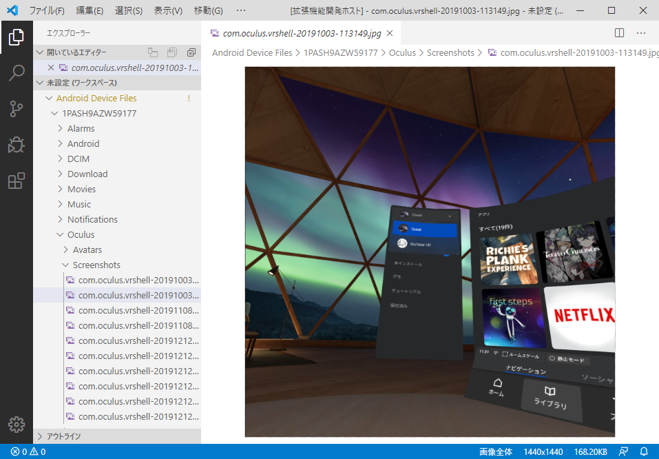

# ADB File System

You can browse the files inside connected Android devices using VSCode!

(experimental implementation)

## Features

* file system using ADB (adbkit)
  * browse devices
  * browse directries
    * currently under /sdcard folder only.
  * read file
  * write file
  * delete file
  * rename file/directory
  * create directory

## Getting Started

* install this extension 'ADB File System'.
* press F1 key in VSCode and select 'Setup Android Device Files Workspace'.

## Requirements

* You need at least one android device(s) connected to your PC.
  * usually via USB cable.
  * over wifi is also possible but need to follow some adb instructions (please see documents of adb).

## Extension Settings

* No settings available

## Known Issues

* Currently, only files or folders under the `/sdcard` folder are available.

## Release Notes

### 0.0.1

Preview release

